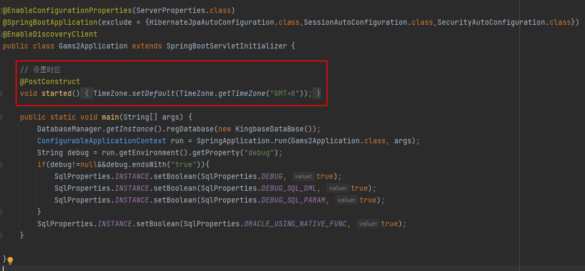
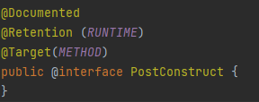
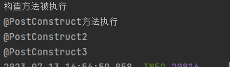
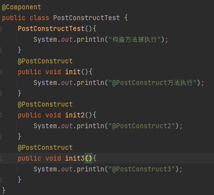

**问题：**

​	在每个项目启动类中，都会添加一个`@PostConstruct`注解标注的方法，设置时区

**@PostConstruct详解：**

**所在包：**

​	`@PostConstruct` 注解是 Java EE 和 Spring Framework 中的一部分，并不是标准的 Java 注解。

​	其所在包：`javax.annotation.PostConstruct`

**使用方法：**

​	`@PostConstruct` 注解是 Java EE 和 Spring Framework 中的一部分，并且需要依赖注入框架来识别并调用被标记的方法。

​	也就是说，只有当使用这些框架创建对象实例并进行依赖注入时，才会触发 `@PostConstruct` 方法的执行。

**作用：**

​	`@PostConstruct` 用于标记一个方法作为在依赖注入完成后立即执行的初始化方法。

​	即当一个bean内有`@PostConstruct`标记的方法，在这个bean创建成功（依赖注入完成）后，会自动执行的方法。

**注意点：**

1. 只能作用在方法上，不能作用在类上：
   

2. `@PostConstruct` 注解的方法不能有任何参数，它只能是无参方法。如果方法有参数，Spring将无法调用该方法。
   有参数的话，会报错：
   BeanCreationException
   Lifecycle method annotation requires a no-arg method: [对应方法全名]

3. 一个类可以有多个`@PostConstruct`注解标注的方法，执行顺序和在类中出现顺序一致。
   但是，不建议使用多个`@PostConstruct`注解，如果需要多个方法直接相互调用就可以了，因为此时依赖注入完毕，可以直接使用对应的方法，且bean被创建，普通方法都可以执行，多个注解会造成性能下降。

   |                           执行结果                           |                            源代码                            |
   | :----------------------------------------------------------: | :----------------------------------------------------------: |
   |  |  |

4. `@PostConstruct` 注解的方法可以声明为 `static`，但是因为类的加载机制，其不可以访问非静态方法和属性。

5. `@PostConstruct` 注解在依赖注入完成后执行初始化操作。因此，使用 `@PostConstruct` 注解的方法可以访问到已注入的依赖。

6. `@PostConstruct` 注解在构造方法之后执行，如上述3中代码所示。

7. `@PostConstruct` 注解通常用于初始化设置，例如数据库连接、缓存加载等任务。

------

