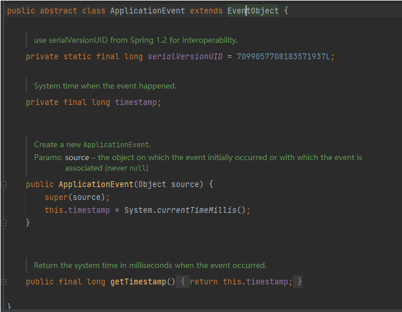

	这里是用到的设计模式称为观察者模式或发布/订阅模式，它允许组件之间解耦并以松散耦合的方式进行通信和交互。

​	通过使用`ApplicationContext`的`publishEvent`和`ApplicationListener`接口，我们能够实现在Spring应用程序中灵活地发布和监听自定义事件，从而实现组件之间的协作和消息传递。

**流程：**

1. 将监听器（继承ApplicationListener，可以指定泛型）先注册到`ApplicationContext`中。
2. 编写自己的事件类（继承ApplicationEvent）
3. 发布自己的事件，`ApplicationContext.publishEvent(自己的事件类)`
4. `ApplicationContext`会遍历已注册的监听器列表，并找到与事件类型匹配的监听器。
5. `ApplicationContext`会调用监听器中的`onApplicationEvent`方法，并将事件对象作为参数传递给该方法。监听器可以在`onApplicationEvent`方法中获取到事件对象，进而对事件作出相应的处理。

​	所以，监听器并不需要主动寻找事件，而是在事件发布时由`ApplicationContext`主动触发监听器的执行。这种设计模式使得事件发布者和事件监听者之间的通信解耦，使得应用程序更加灵活和可扩展。

**ApplicationEvent:**

​	继承了`EventObject`，常用方法：

- `getSource()`：获取触发事件的对象，即事件的来源。
- `getTimestamp()`：获取事件的时间戳，表示事件发生的时间。
- `toString()`：返回事件的字符串表示形式，通常是事件类的名称和附加的描述信息。

**EventObject:**

