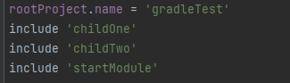
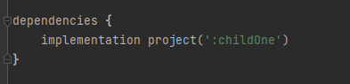
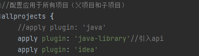

### 1、父子工程(项目结构)：

```
parent-project/
├── settings.gradle
├── build.gradle
├── child-project1/
│   └── build.gradle
└── child-project2/
    └── build.gradle
```

父工程通过allprojects 和 subprojects 构建脚本中配置依赖、插件和其他属性。

​	`allprojects`配置应用于所有项目（当前项目和子项目以及后代项目）

​	`subprojects`配置仅应用于子项目（不包括当前项目和后代项目）

### 2、同级模块之间引用

 首先要确保每个模块都在settings.gradle中配置：

​	

然后在需要依赖其他模块的模块里，在其build.gradle的dependencies中引入即可：



**注意**：

​	如上述例子，在`childOne`中依赖了mybatisplus，`startModule`引入了`childOne`。

​	如果`childOne`使用implementation引入mybatisplus依赖的话，`startModule`必须自己也引入mybatisplus依赖。**即implementation引入的依赖仅在本模块可用，不传递。**

​	如果`childOne`使用api引入mybatisplus依赖的话，`startModule`不需要引入mybatisplus依赖。**即api引入的依赖传递。**

​	api在插件java-library中，java中没有，因此想要使用api需要更换插件：

​	

### 3、include和includeBuild区别：

​	在Gradle中，`include`和`includeBuild`都是用于在`settings.gradle`文件中声明要包含的子模块或构建脚本的语句。`include`和`includeBuild`语句都是在`settings.gradle`文件中使用的，并且它们都用于指定要包含的模块或脚本的路径。它们之间的区别如下：

1. `include`：用于引入项目的子模块或子项目（Subproject）。

   - 格式：`include 'subproject-name'`
   - 作用：将指定的子项目包含到 Gradle 多项目构建中。
   - 示例：`include 'module1', 'module2'`

   使用`include`语句后，Gradle会识别并构建相应的子模块，允许您对每个子模块进行单独的配置和构建。

2. `includeBuild`：用于引入其他独立的构建脚本。

   - 格式：`includeBuild 'path/to/build-script'`
   - 作用：将指定的独立构建脚本引入到当前项目中。
   - 示例：`includeBuild '../common-build'`

   ​		使用`includeBuild`语句后，Gradle会在当前项目中加载指定的构建脚本，在构建过程中执行其中定义的任务和配置。这使得可以共享和重用通用的构建逻辑和配置。
   
   ​	 `include` 和 `includeBuild` 都是 Gradle 构建系统中用于在一个项目中引入其他模块或项目的机制，但它们的使用场景和作用略有不同。`include` 用于包含当前项目的子模块或子项目，而 `includeBuild` 则用于引用独立的 Gradle 项目或模块。

### 4、setting.gradle和build.gradle作用

- build.gradle - 文件包含项目构建所使用的脚本。
- settings.gradle - 文件将包含必要的一些设置，例如，任务或项目之间的依懒关系等
- settings.gradle编译优先级高于build.gradle

**setting.gradle:**

​	settings.gradle是模块Module配置文件，主要是用于配置子模块，根目录下的setting.gradle脚本文件是针对module的全局配置。

​	`settings.gradle` 文件用于定义 Gradle 多模块项目的结构，它指定了包含哪些子项目或模块。通过在 `settings.gradle` 文件中声明子项目，Gradle 才能正确地管理和构建这些子项目。此外，`settings.gradle` 还可以用于配置项目之间的依赖关系、控制构建顺序以及定义其他项目级别的设置。

```properties
// 为指定父模块的名称 平台根
rootProject.name = 'project-root'
//包含子系统以及模块
include ':project-core'
//Hello系统模块的加载
include ':project-hello'
//World系统模块的加载
include ':project-world'
```

**build.gradle:**

​	`build.gradle` 文件是每个子项目的构建脚本，它描述了如何构建和配置单个子项目。每个子项目都有自己的 `build.gradle` 文件，这些文件可以包含项目的任务、依赖项、插件、构建配置等。


​	所以在 `settings.gradle` 文件中通过 `include` 引入了项目 A，但没有在当前项目的 `build.gradle` 文件中声明对项目 A 的依赖关系，那么意味着当前项目只是将项目 A 纳入了 Gradle 的管理范围，并没有真正地将项目 A 作为依赖引入到当前项目中。

​	在这种情况下，当前项目无法直接使用项目 A 中的类或资源。虽然项目 A 被包含到了当前项目中，但并不等同于项目 A 已成为当前项目的编译依赖。如果需要在当前项目中使用项目 A 的类或资源，需要在当前项目的 `build.gradle` 文件中声明对项目 A 的依赖，以将其作为编译时或运行时的依赖项进行引入。

#### 5、Gradle 工作流程

1. 初始化阶段：
   - Gradle 首先会解析 `settings.gradle` 文件，确定包含哪些子模块或子项目。
   - 在该阶段，还没有执行各个 `build.gradle` 中的任务（Task）。
2. 配置阶段：
   - Gradle 会解析每个 Project 中的 `build.gradle` 文件，创建相应的项目和任务，并确定它们之间的依赖关系。
   - 在该阶段，Gradle 会构建一个有向图来描述任务之间的依赖关系，也就是所谓的任务图。
   - Task 在这个阶段被创建，但并不会立即执行。而是在后续的执行阶段根据依赖关系来决定执行顺序。
3. 执行阶段：
   - 包括了实际执行各个 Task 的阶段。
   - Gradle 根据任务图中的依赖关系，从入口任务开始逐个执行任务。
   - 每个任务的执行顺序由任务图中的依赖关系决定，只有当一个任务的所有依赖都已完成时，才会执行该任务。
   - 执行阶段中的任务可以是编译、测试、打包、部署等等。

​      在 Gradle 构建流程中，初始化阶段主要是解析项目结构和配置文件，配置阶段则是确定任务之间的依赖关系和构建图，最后在执行阶段根据图的顺序逐个执行任务。这个流程帮助确保项目能够按照正确的顺序进行构建，并满足任务之间的依赖关系。

### 6、gradle多项目(对应IDEA多module)配置

​	通过了解七、中gradle两大配置文件的作用，多模块配置时，首先当前模块的gradle需要管理到被管理的模块，即首先需要在当前模块的settingf.gradle中配置需要管理的项目。

​	此时其他模块仅被gradle管理了，并未作为当前模块的依赖项，当前模块并不能访问其他模块的类，其他模块的bean也不能被当前模块所识别管理，此时需要在当前模块的build.gradle中将其他模块作为依赖项进行依赖即可。

### 7、gradle的dependencyManagement与maven的parent

#### 1.maven的parent

​	如下图代码，在Maven中使用Spring Boot的起步依赖（spring-boot-starter-parent）时，这个父项目会提供一些常用依赖的版本管理。

​	Spring Boot的起步依赖定义了一组默认的依赖版本，这包括了Spring框架、Spring Boot自身的模块、日志框架等常用的依赖信息。

​	**通过继承这个父项目，您可以方便地使用这些默认的依赖版本，而不需要显式指定版本号。**

```xml
<project>
    ...
    <parent>
        <groupId>org.springframework.boot</groupId>
        <artifactId>spring-boot-starter-parent</artifactId>
        <version>2.6.0</version>
    </parent>
    ...
    <dependencies>
        <dependency>
            <groupId>org.springframework.boot</groupId>
            <artifactId>spring-boot-starter-web</artifactId>
        </dependency>
        <!-- 其他依赖... -->
    </dependencies>
    ...
</project>
```

​	那么在gradle种该如何实现类似的功能呢？

#### 2.首先要了解BOM文件：

​	BOM（Bill of Materials）文件是一种用于管理项目依赖版本的特殊类型的依赖描述文件。它通常用于 Maven 和 Gradle 构建系统中，用于集中定义和管理项目所需的第三方依赖库及其版本号。

​	具体来说，BOM 文件通常包含了一组依赖库的坐标（如groupId、artifactId）以及它们的版本号。这些依赖库可以是项目需要直接引用的库，也可以是其他库所依赖的传递性依赖。在使用 BOM 文件时，项目可以简单地引入该 BOM 文件，然后在项目的依赖管理部分声明依赖，而无需显式指定每个依赖的版本号。

​	在 Gradle 中，BOM 文件通常采用特定的命名约定（例如以 `platform` 结尾）来表示其作为 BOM 文件的角色。通过引入 BOM 文件并在项目中使用 `dependencyManagement` 来声明依赖，可以实现对依赖版本的集中管理和控制。

#### 3.gradle的dependencyManagement

1. **集中管理版本号**: 通过引入 BOM 文件并在 `dependencyManagement` 部分声明依赖，项目可以将所有依赖库的版本号集中管理在一个地方。这意味着开发人员不需要在每个模块或子项目中重复指定版本号，而是可以通过 BOM 文件来控制所有依赖库的版本。
2. **隐式版本传递**: 当一个依赖库由 BOM 文件管理时，它的版本号会被隐式地传递给项目中的所有模块和子项目，即使在这些模块和子项目中没有显式声明该依赖的版本号。这样可以确保整个项目中使用的依赖库版本保持一致。
3. **简化声明**: 在项目中声明依赖时，不需要显式指定版本号。相反，只需列出所需的依赖库，而版本号则可以由 BOM 文件和 `dependencyManagement` 来管理。
4. **易于维护**: 当需要升级依赖库的版本时，只需更新 BOM 文件中的版本号，所有使用了该 BOM 的项目将自动采用新的版本号，从而简化了维护工作。

​	综合来说，`dependencyManagement` 和 BOM 提供了一种简单而强大的方式来管理项目中的依赖库版本，确保它们的一致性，并减少了重复和混乱的版本号声明。这有助于提高项目的可维护性和稳定性。

如下代码：

```gradle
plugins {
    id 'org.springframework.boot' version '2.6.0'
    id 'io.spring.dependency-management' version '1.0.11.RELEASE'
}

dependencyManagement {
    imports {
        mavenBom("org.springframework.boot:spring-boot-dependencies:2.6.0")
    }
}

dependencies {
    implementation 'org.springframework.boot:spring-boot-starter-web'
    // 其他依赖...
}
```


