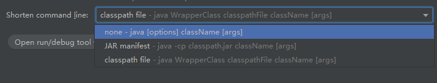

​	如果类路径太长，或者有许多VM参数，程序就无法启动。原因是大多数操作系统都有命令行长度限制。

在这种情况下，IDEA将试图缩短类路径：

shorten command line 选项提供三种选项缩短类路径：

1. none：这是默认选项，idea不会缩短命令行。如果命令行超出了OS限制，将无法运行应用程序，但是工具提示将建议配置缩短器。　
2. JAR manifest：idea 通过临时的classpath.jar传递长的类路径。原始类路径在MANIFEST.MF中定义为clsspath.jar中的类路径属性。
3. classpath file：idea 将一个长类路径写入文本文件中。