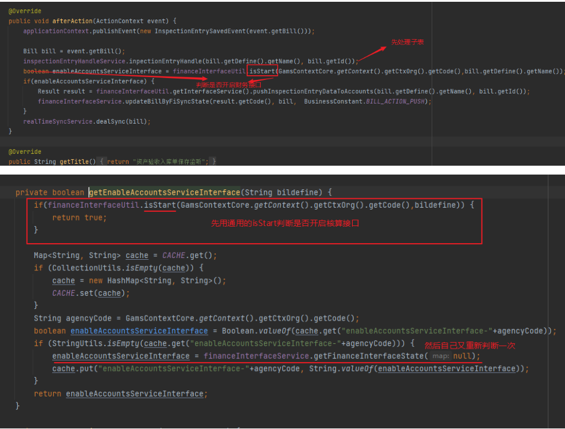

#### 引入：

​	资产处置无偿划转接收方验收入库财务没有收到数据

**原因：**

​		前提：湖北消防个性化了判断是否开启核算接口的方法（切面），称为通用核算接口判断方法(isStart)

​		而验收入库业务有些问题，子表和主表各自去判断是否开启财务接口。

​		而主表是采用通用核算接口判断方法，子表在采用通用核算接口判断方法后，又自己重新判断，导致个性化判断方法对子表未生效。

#### 解决方案

##### 1、切面解决

**前提：**

​	对应的类被Spring的IOC管理，同时该方法是public,而非private

**具体实现：**

​	具体实现可以去了解切面（记录过笔记），本例不合适。

##### 2、通过改变Bean的优先级

**前提：**

​	对应的类是面向接口设计的，调用方也是使用接口调用。

**适合使用：**

​	这种方式适用于通过接口来定义依赖的情况。

**具体实现：**

​	可以编写一个新的类来实现对应接口，并在新类上添加 @Primary 注解。这样，在进行自动装配时，新类的实例将作为首选的 Bean 被注入，从而实现对原有类的替换。

**@Primary 注解：**

​	`@Primary` 是 Spring 框架中的一个注解，用于标识当存在多个候选 Bean 时，首选哪一个 Bean。

​	当 Spring 需要自动装配（autowired）一个接口或者抽象类时，如果有多个候选 Bean，那么 Spring 将会使用拥有 `@Primary` 注解的 Bean，并将其注入到需要的位置。

##### 3、 `@ConditionalOnMissingBean` 注解，覆盖对应的Bean

**前提：**

​	被覆盖的 Bean 上有 `@ConditionalOnMissingBean` 注解。

**实现：**

​	直接创建一个与想要覆盖的类同名的bean，达到覆盖的作用。

**适合使用：**

​	这种方式适用于无法通过接口来定义依赖的情况，或者对于没有使用接口进行定义的具体类。

**`@ConditionalOnMissingBean` 注解：**

​	如果依赖中的 Bean A 使用了 `@ConditionalOnMissingBean` 注解，并且在解析 Bean 定义时发现存在两个 Bean A 的定义（一个是依赖中的，一个是自己代码中想要覆盖的），那么以下是发生的情况：

1. 首先，Spring 解析 Bean 定义，并将依赖中的 Bean A 的定义加载到应用程序上下文。
2. 当扫描到依赖中的 Bean A 时，Spring 发现它使用了 `@ConditionalOnMissingBean` 注解，表示如果已经存在同名的 Bean，则不会继续创建该 Bean。
3. 接下来，Spring继续扫描其他的 Bean 定义，并发现了自己代码中的 Bean A 定义。
4. 因为在之前的步骤中依赖中的 Bean A 已经存在，而且存在 `@ConditionalOnMissingBean` 注解，Spring 将忽略依赖代码中的 Bean A 定义。

​    总结起来，当解析 Bean 定义时，如果依赖中的 Bean A 使用了 `@ConditionalOnMissingBean` 注解，即使依赖中的 Bean A 先被创建，Spring 仍然会检查是否存在其他同名 Bean 的定义。只有当没有其他同名的 Bean 定义时，依赖中的 Bean A 才会被真正创建。

​	这样，您可以通过自己的代码中的 Bean 定义来覆盖依赖中的同名 Bean。

​	如果存在`@ConditionalOnMissingBean` 注解，如果已经存在同名的 Bean，则被覆盖的 Bean 不会被创建。因此，可以通过定义一个与被覆盖的 Bean 同名的 Bean 来达到覆盖的效果。

##### 4、继承和重写，替换对应的Bean

**前提：**

​	对应的bean是通过类型注入，自动注入的。

​	对应的类可以被继承，对应的方法可以被重写。

**适合使用：**

​	这种方式适用于通过接口来定义依赖的情况，且被重写的类可以被继承，对应方法可以被重写。

**具体实现：**

​	可以编写一个新的类来继承需要修改的类，并在新类上添加 @Primary 注解。这样，在进行自动装配时，新类的实例将作为首选的 Bean 被注入，从而实现对原有类的替换。

​	类似于上述的方法2、改变优先级，这里是继承对应的类，2中是实现对应接口，可以根据不同情况灵活选择。

**原理：**

​	继承和重写等技术覆盖了依赖中某个类的方法后，在Spring应用上下文中进行自动依赖注入时，如果指定的bean类型与被重写的类型匹配，Spring会先尝试注入子类（重写类），而非原始的依赖类。

​	即**在Spring中，在自动依赖注入过程中，Spring会优先注入子类（重写类）。**

##### 5、同胞同名类覆盖

​	不建议使用该种方式

**前提：**

​	没有前提

**适合使用：**

​	这种方式适用上述方法都不适合使用的情况。

**具体实现：**

​	可以编写一个新的类，与被覆盖的类同包同名。

​	然后不需要注册成bean。即不需要在配置类中进行注册。

**原理：**

​	spring会优先使用当前项目中的类去注册。

##### 6、使用字节码操作库

​	字节码操作库（如ASM、Byte Buddy等）可以直接操作字节码，从而实现对类方法的改写。

​	可以使用字节码操作库来修改目标方法的字节码指令，达到改写方法的效果。

​	这种方法通常比较复杂，需要对字节码和底层 JVM 运行机制有一定的了解。